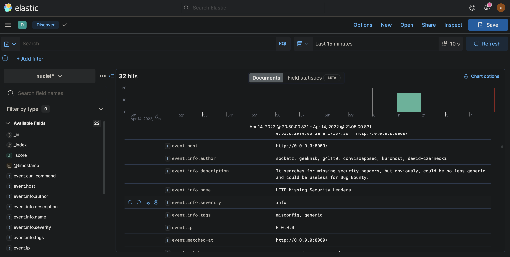

# Elasticsearch

Nuclei can be configured to send found issues to an elasticsearch index. Use the below configuration template for elasticsearch reporting config.

```yaml
# elasticsearch contains configuration options for elasticsearch exporter
elasticsearch:
  # IP for elasticsearch instance
  ip: 127.0.0.1
  # Port is the port of elasticsearch instance
  port: 9200
  # IndexName is the name of the elasticsearch index
  index-name: nuclei-test
  # SSL enables ssl for elasticsearch connection
  ssl: true
  # SSLVerification disables SSL verification for elasticsearch
  ssl-verification: true
  # Username for the elasticsearch instance
  username: elastic
  # Password is the password for elasticsearch instance
  password: Jc4jGQsP0zufS+Kn77d-
```

Create an index in elasticsearch with below command (if it is already created, the below step can be skipped).

```http
PUT /nuclei-test
```

Run nuclei with the above config config file - 

```
nuclei -t ~/nuclei-templates/ -rc reporting-config.yaml -l list.txt
```

