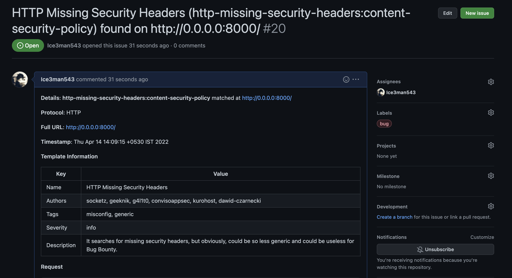
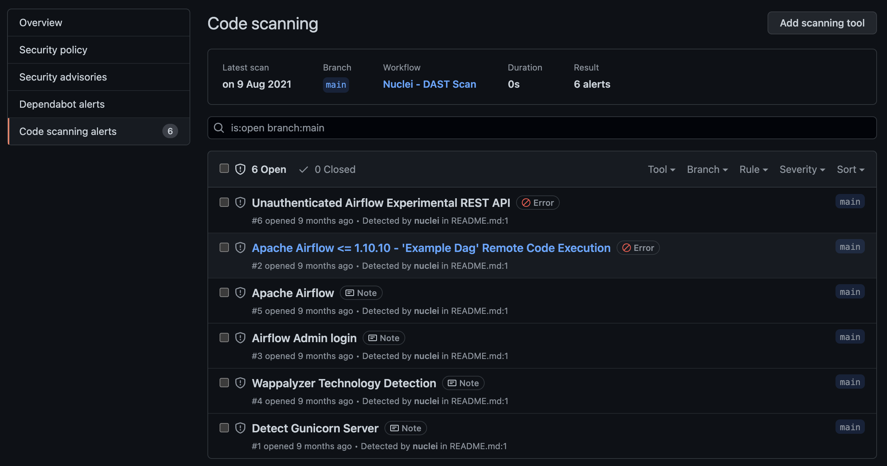

# Github

Integration can be done with Github in form of either reported Issues, Sarif or Github Actions to execute Nuclei on assets. All the ways are described below in the document.

## Github Issues

Create a reporting config with the fields for Github configured. A reference configuration is provided below.

```yaml
# Example reporting-config.yaml
github:
  # username is the username of the GitHub user
  username: ice3man543
  # owner is the owner name of the repository for issues
  owner: ice3man543
  # token is the token for GitHub account
  token: ghp_tokenEXAMPLEVALUE
  # project-name is the name of the repository
  project-name: nuclei-checks
  # issue-label is the label of the created issue type
  issue-label: bug
```

Run nuclei with the above config config file - 

```
nuclei -t ~/nuclei-templates/ -rc reporting-config.yaml -l list.txt
```



## Github Actions / SARIF

Create a workflow in `.github/workflows/nuclei.yaml` with the below contents. 


```yaml
name: Nuclei - DAST Scan

on:
    schedule:
      - cron: '0 0 * * *'
    workflow_dispatch:

jobs:
  nuclei-scan:
    runs-on: ubuntu-latest
    steps:
      - uses: actions/checkout@v2
      - uses: actions/setup-go@v2
        with:
          go-version: 1.17

      - name: Nuclei - DAST Scan
        uses: projectdiscovery/nuclei-action@main
        with:
          target: https://example.com

      - name: GitHub Security Dashboard Alerts update
        uses: github/codeql-action/upload-sarif@v1
        with:
          sarif_file: nuclei.sarif
```

More details on the Github Action can be found [here](https://github.com/projectdiscovery/nuclei-action).

