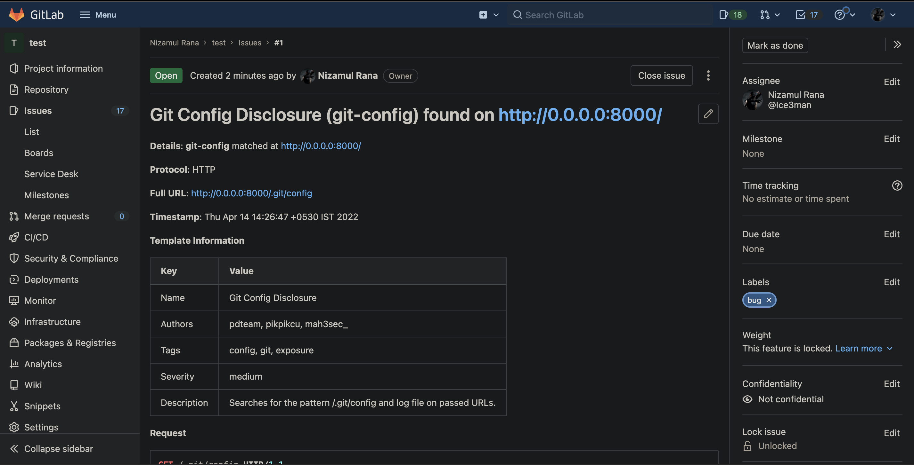

# Gitlab

Create a reporting config with the fields for Gitlab configured. A reference configuration is provided below.

```yaml
# Example reporting-config.yaml
gitlab:
  # username is the username of the GitLab user
  username: ice3man
  # token is the token for GitLab account
  token: test-glpat-Example_Value
  # project-name is the name/id of the project(repository)
  project-name: "35351516"
  # issue-label is the label of the created issue type
  issue-label: bug
```

Run nuclei with the above config config file - 

```
nuclei -t ~/nuclei-templates/ -rc reporting-config.yaml -l list.txt
```


