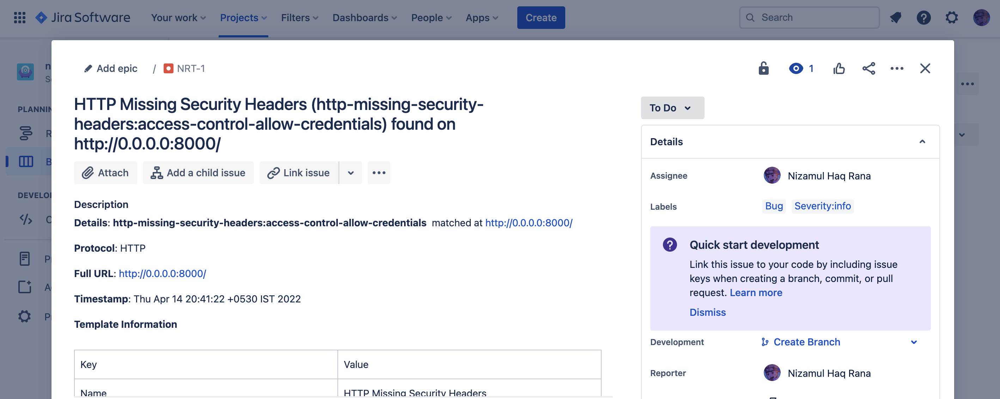

# Jira

Nuclei can be configured to send found Issues to Jira Issue Tracker. Create a reporting config with the fields for Jira configured. A reference configuration is provided below.

> Make sure the `Bug` issue-type is added to your project while using it in configuration.

```yaml
# Example reporting-config.yaml
jira:
  # cloud is the boolean which tells if Jira instance is running in the cloud or on-prem version is used
  cloud: true
  # URL is the jira application url
  url: https://projectdiscovery.atlassian.net
  # account-id is the account-id of the Jira user or username in case of on-prem Jira
  account-id: 5fcb405178f01800769b7c3f
  # email is the email of the user for Jira instance
  email: test@projectdiscovery.io
  # token is the token for Jira instance or password in case of on-prem Jira
  token: 7mWTestExampleToken
  # project-name is the name of the project.
  project-name: test-bugs
  # issue-type is the name of the created issue type (case sensitive)
  issue-type: Bug
  # SeverityAsLabel (optional) sends the severity as the label of the created issue
  severity-as-label: true
```

Run nuclei with the above config config file - 

```
nuclei -t ~/nuclei-templates/ -rc reporting-config.yaml -l list.txt
```

