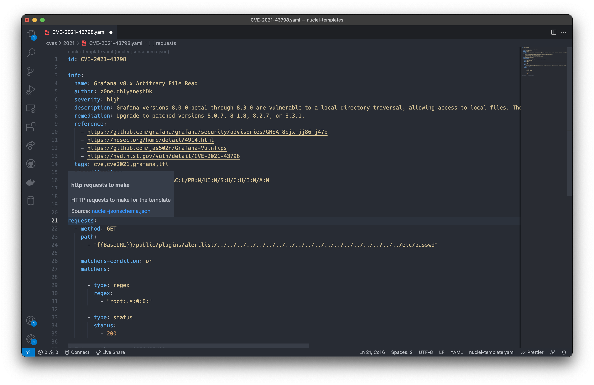

# Getting Started

## Running Nuclei Locally

Nuclei can be installed locally by using OS specific commands.

Using Go:

The following go command can be used to install the latest version of nuclei.

```
go install -v github.com/projectdiscovery/nuclei/v2/cmd/nuclei@latest
```

For MacOS (Brew):

```
brew install nuclei
```

Using Docker:

```
docker pull projectdiscovery/nuclei:latest
```

For more installation options and details, see the [Installation Details](../cli/installation.md) section.

A successful installation can be confirmed by using any of the below commands

```
# Running nuclei --help should shown the help menu for nuclei
nuclei --help

# Should show the version of nuclei installed
nuclei --version
```

See [CLI Reference](../references/cli.md) // todo: change link // for a list of CLI Options supported by nuclei.

## Writing Nuclei Templates

Nuclei Templates follow a simple YAML based DSL. The syntax is described in [Templates Guide](../language/guide.md) // todo: change link // section. 

Information on how to setup your environment for effective integration while writing Templates is described in [Environment Setup](../cli/environment-setup.md) section. 

To summarise, if you have Visual Studio Code installed, automatic Intellisense and Code-Completion will be provided when writing yaml files in `nuclei-templates` named folder. For other editors, their relevant docs for configuration are provided on the above linked page.

