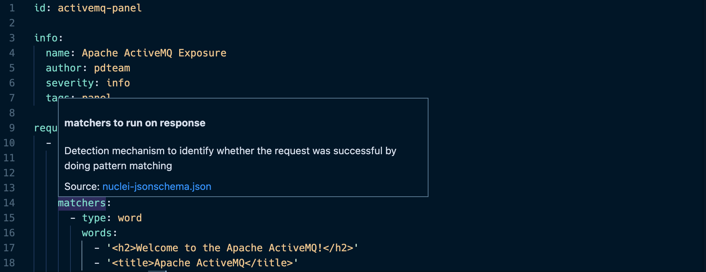
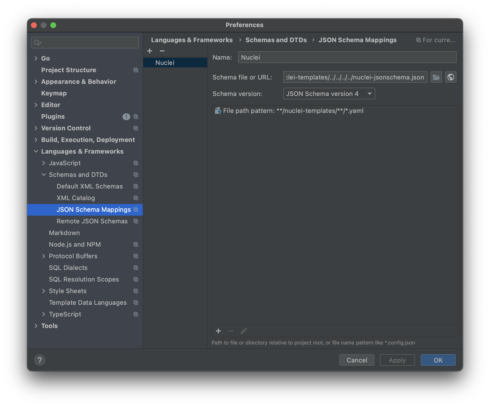
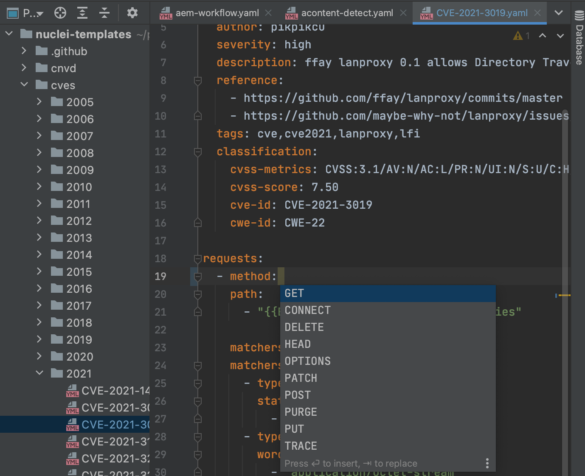

# Environment Setup

Templates are defined in easy-to-write `YAML` files. These can be written in any Text Editor of your choice. An [JSONSchema](https://github.com/projectdiscovery/nuclei/blob/master/nuclei-jsonschema.json) file is provided for Nuclei syntax, which can be used with IDEs to provide **code-completion** and **intellisense** for nuclei template files.

Setup process of intellisense for a few editors is described below.

## VSCode

The setup process for VSCode is very simple. First, make sure you have the [vscode-yaml](https://marketplace.visualstudio.com/items?itemName=redhat.vscode-yaml) package installed. The intellisense for nuclei works out-of-the box if you have this extension installed. For manual configuration, the below steps can be followed for VSCode.

The next step is to configure the editor to use the Nuclei schema for Validation. This can be done by opening **Command Palette** (CMD + Shift + P on Mac) and typing `Open Settings`. Now Click on `Preferences: Open Settings (JSON)` option which should have appeared in the Dropdown.

This will open the VSCode JSON settings file. Add the provided JSON below in the configuration file and you should be good to go.

```json
"yaml.schemas": {
    "https://raw.githubusercontent.com/projectdiscovery/nuclei/master/nuclei-jsonschema.json": "**/nuclei-templates/**/*.yaml"
}
```

Open the nuclei-templates folder and visit any template, hovering over the fields. It should now show field information as well as any syntax errors or problems in the templates. Auto-completions for the field names as well as supported values will also be displayed in the editor upon pressing key-binds (in VSCode on Mac it is Control + Space).



## Intellij IDEA / Goland


The setup process for IntelliJ IDEA is similar. This also applies to other products like Goland, etc, by IntelliJ. 

Goto `Preferences -> Languages & Frameworks -> Schemas and DTDs -> JSON Schema Mappings` option.  Click on the + button and add a new option called `Nuclei` with the values configured as in the screenshot below.

Schema URL: `https://raw.githubusercontent.com/projectdiscovery/nuclei/master/nuclei-jsonschema.json`
File Path pattern: `**/nuclei-templates/**/*.yaml`



Click OK and the YAML IntelliSense as well as other IDE features should now work with nuclei templates.

